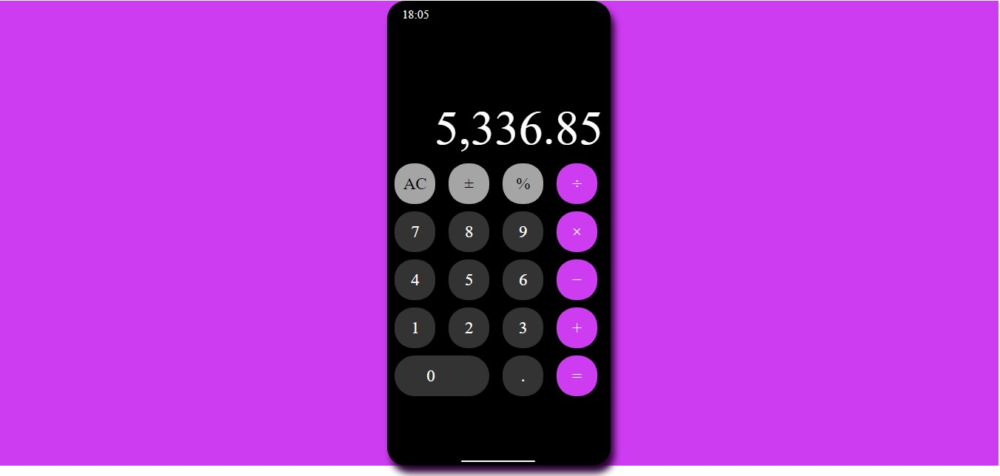

<h1>
  <a href="https://web-calculator-c5155.firebaseapp.com/"
  title="Click to view calculator"
  >
    Web calculator
  </a>
</h1>

Key Concepts Utilized in Developing this Project:
- Functional Components in React
- React Hooks (useState and useEffect)
- CSS Grid
- CSS Flexbox

Install prettier

prettier eslint-config-prettier

Create Components folder- Create an App folder inside the Components folder repo-Create App.js and App.css inside that App folder.

Import App.js file from the App folder to index.js

Create Button folder and create Button js and Button css files in the Button repo.

Pass in content prop to Button component. Update content prop as symbols and numbers in App.js file

Name Button component TYPES: (AC, ±, % as function) (÷, x, -, + and = symbols as operator)

Add useState and handleButtonPress to App.js component
Destructure prop (handleButtonPress) from Button component
Add onClick event to Button component, to click the div in that component and pass in content to the onButtonClick. However, to distinguish what button to press, I passed in content as parameter to handleButtonPress in App.js, set const num to parseFloat(value); and also wrote some conditional statements.

Having 2 arrow functions in handleButtonPress inside App.js, so it doesn't call the function immediately.

Pass value from useState inside the display div
Set memory from useState to remember whatever value (number and symbols) entered.

In App component, when you press AC, setMemory back to null, as well as, setValue back to "0". Conditionla statement was used to achieve this.
Set % also back to null

To remember that operator has been clicked, I set Operator (useState)

At this point, I realized that the calculator can only perform 2 operations, at a time, and you need to reset it with AC functionality, to carry out another calculation. E.g 2+ 1 would give you the right answer 3, but 1 + 2+ 3 will not give you the right answer 6, since we now have more than 2 numbers to calculate. Instead, it considers and calculates only the last the numbers and gives 5, for instance.
  HERE IS HOW I SOLVED THAT----
If operator is not =/= null(that is, if we have previous operation), then we have to perform that operation first, by giving other conditional statements in equals sign to other symbols, too.

setValue changes to setMemories

And ELSE, we will only be setting the latter memory in any of the symbols, if it is not any if the setMemory already established in the conditional statements in any given symbol

Also, remove the first toString in every symbol conditional statements

DECIMAL POINT
Add decimal point "." .. Also, check if there is a decimal point, already, to avoid adding it multiple times. and add value the decimal point. All these done, sing conditional statements.

In the equal symbol, if value at value.length minus 1, then we have typed in a dot ( === "."). So, set value plus the content, else  setValue(as what we had in the equal symbol already.)

Add time, using useState to setTime to new Date, and get hours and also get minutes to display at the top of the app. This will show real time, when the app is open.

To have the hours and minutes of the time from 1 to 9 show zero before them, e.g. 1 displays 01, 2 displays 02, etc., add to string and padStart to minutes and set the padStart to 2, and pad it with "0". Do the same with hours.

Add comma after every 3 numbers displayed, by creating a comma component and importiing it to App, as well as passing value to it on the display {comma(value)}.